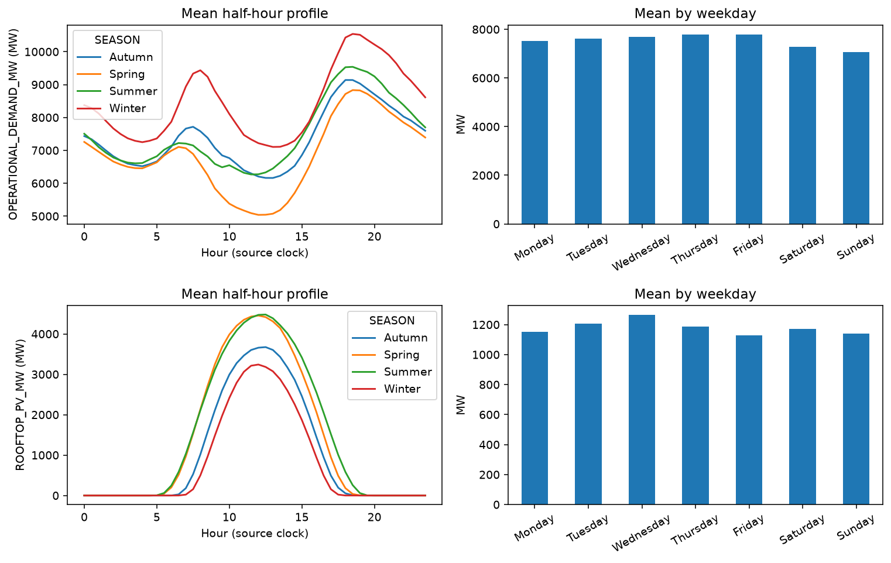
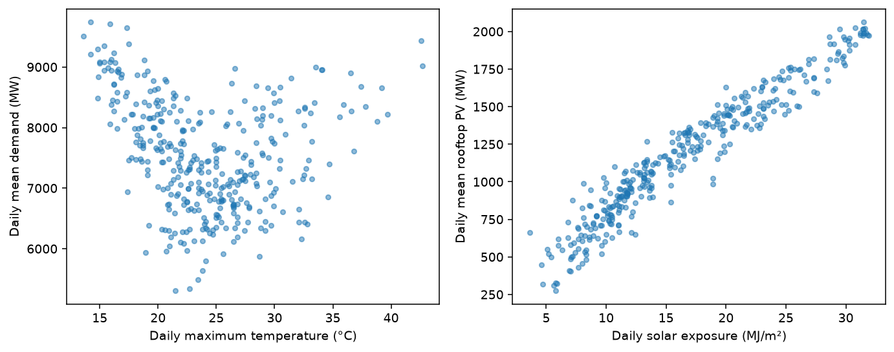
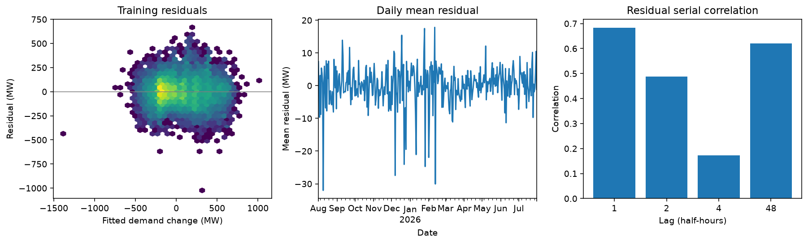
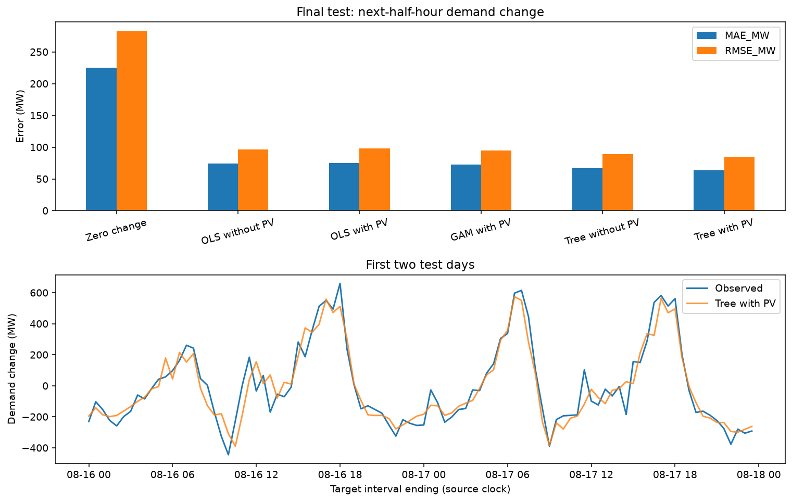

# Week 3 modelling notes

20 September 2026. Working record for [initial_modelling.ipynb](initial_modelling.ipynb), not a report draft.

## What I used

- Changed from sample data to  `NSW1_Historical_Modelling_Dataset_Week3.csv`. The source files were left alone.
- Checked the data dictionary, quality summary, preparation script and existing Week 3 workbook. The workbook covers the whole merged period; the new EDA uses the training year only.
- Training: **1 August 2025–31 July 2026**. Validation: **1–15 August 2026**. Test: **16–31 August 2026**.
- All 17,520 training half-hours are available for EDA. The explanatory comparisons use 17,509 complete rows; forecasts use 17,468 training rows after the history requirements and missing values. Validation has 720 rows and the forecast test has 768.
- Forecast splits use the target timestamp. For example, the 31 July 23:30 observation predicts 1 August 00:00 and belongs to validation, not training.

## Checks before fitting

- There are no duplicate timestamps or missing half-hour intervals
- Demand is complete
- PV is missing at **9 August 2025, 16:30**; its quality flag is 0, but the supplied ramp label says “No change”. It is not used

PV quality flags are 1.0 for 18,874 rows, 0.7 for 133 and 0.0 for one. Kept the non-missing observations for the first pass and checked a quality-1 subset separately. The flag definitions still need confirming before treating 0.7 as an exclusion rule.

Weather coverage is not uniform. The supplied 99.7% weather-match figure checks maximum temperature, not every weather field.

| Missing weather | Whole file: days (rows) | Training: days |
| --- | ---: | ---: |
| Maximum temperature | 1 (48) | 1 |
| Rainfall | 11 (528) | 11 |
| Sunshine | 28 (1,344) | 26 |
| 9 am cloud | 6 (288) | 6 |
| 3 pm cloud | 14 (672) | 12 |

Minimum temperature, humidity and daily solar exposure have no missing values. The notebook includes summaries of all nine weather inputs. The one missing training day of maximum temperature was filled with the **training median, 23.5°C**, for explanatory modelling only. PV and demand were not filled.

Recalculated demand/PV changes and 30–120-minute PV-change lags. Existing changes agree wherever both versions can be checked; the maximum PV difference is just floating-point rounding. Supplied PV/demand level lags also agree within the file. The new first-row changes and unavailable starting lags are missing rather than using unverified history from before the file begins.

The clock needs checking. Timestamps have no time zone, and weather is joined to the interval's calendar date, including midnight. I have not assumed that this resolves interval-ending dates, daylight saving or BoM observation-day conventions. Sydney weather is only a local proxy for NSW conditions.

## What stood out in the training data

Mean operational demand is **7,537.8 MW**, with a range of 2,848–13,182 MW. Mean rooftop PV is **1,178.4 MW**, with a maximum of 5,864.4 MW. Half-hourly demand changes have a standard deviation of 267.0 MW; PV changes have a standard deviation of 284.9 MW.

Winter has the highest mean demand (8,456.5 MW) and lowest mean PV (806.4 MW). Spring mean demand is 6,828.5 MW; summer mean PV is 1,482.8 MW. The profiles show morning/evening demand peaks and a midday trough, particularly in spring. Weekend demand is lower: Sunday averages 7,067.1 MW compared with 7,792.7 MW on Thursday. Weekday PV differences are descriptive, not evidence of a weekday effect on generation.

Daily mean demand looks curved against maximum temperature, which makes a GAM worth trying. Daily mean PV rises strongly with solar exposure. These plots have one point per day, not 48 repeated weather observations.

Current demand/PV changes correlate at **−0.673**. Pairing demand change with PV change 30, 60, 90 and 120 minutes earlier gives **−0.646, −0.576, −0.481 and −0.366**. Regular daily patterns are still in these correlations; they do not establish delayed effects.

The raw relationship varies by time: correlations are 0.202 at 00–06, −0.723 at 06–12, −0.842 at 12–18 and −0.479 at 18–24. The overnight result is not very informative about PV because its variation is small.

[First training week](week_3_plots/01_first_week.png) · [Change distributions and scatter](week_3_plots/02_changes.png) · [Correlations](week_3_plots/05_correlations.png)

## First regressions

Outcome: current half-hour demand change. Start with current PV change, then add half-hour slot, weekday, season, maximum temperature and daily solar exposure. Do not duplicate those calendar controls with month, hour and weekend fields. Weather here describes the completed day; it is not a forecasting input.

The larger models add four PV-change lags, then PV interactions with afternoon (12–18) and daily solar exposure. All comparisons use the same rows. Coefficient intervals use HAC standard errors over 48 retained observations, roughly one day.

| Explanatory model | Validation MAE (MW) | RMSE (MW) | Current PV coefficient | 95% HAC interval | Training adjusted R² |
| --- | ---: | ---: | ---: | --- | ---: |
| PV only | 211.84 | 267.87 | −0.631 | −0.646 to −0.615 | 0.454 |
| Calendar + weather | 123.31 | 160.54 | −0.738 | −0.766 to −0.710 | 0.799 |
| Add PV lags | 123.10 | 160.16 | −0.710 | −0.743 to −0.677 | 0.799 |
| Add time/solar interactions | 122.32 | 159.06 | −0.747 | −0.785 to −0.710 | 0.800 |
| GAM | 118.89 | 153.84 | — | — | — |
| Tree benchmark | 91.97 | 115.39 | — | — | — |

The simple adjusted OLS estimate associates a 100 MW increase in PV over a half-hour with about **73.8 MW less demand change**, holding its controls fixed. This is not a causal estimate.

The interaction OLS has the lowest validation MAE among the regressions, although the improvement is small. Its main PV coefficient applies outside the afternoon at mean solar exposure (16.64 MJ/m²). The afternoon interaction is +0.0526, with an interval of −0.0006 to +0.1058: not clear evidence of a different adjusted slope. The solar interaction is +0.0213 per additional 10 MJ/m², with an interval of +0.0010 to +0.0415, suggesting a slightly less negative slope on sunnier days within this specification.

The four lag coefficients in that model are −0.0488, +0.0176, −0.0152 and +0.0121. The first two intervals exclude zero, but the alternating signs and correlated inputs make a delayed-effect interpretation doubtful. Their full intervals are saved in the notebook.

### Collinearity and residuals

- Conditional VIFs are about **11.8** for the middle PV-change lags and 7.8 for the current/fourth-lag changes. Maximum temperature is 3.6 and solar exposure 5.7 in the wider candidate set.
- Daily minimum/maximum temperatures correlate at 0.75; sunshine/solar exposure at 0.72; sunshine/3 pm cloud at −0.74. Kept maximum temperature and solar exposure rather than all these partly overlapping weather inputs.
- **No PCA for now.** It would obscure the PV coefficients. Try fewer lags before adding dimensionality reduction.
- The selected OLS residual correlations are **0.683 at 30 minutes, 0.488 at 60 minutes, 0.172 at two hours and 0.620 at one day**. There is still substantial structure to explain. HAC intervals do not fix that model limitation; they also use retained-row spacing after a few exclusions and do not account for model selection.
- Restricting the simpler calendar/weather fit to quality-1 current and previous PV observations leaves 17,431 rows. Its PV coefficient changes only from −0.7376 to −0.7357 (HAC interval −0.7638 to −0.7075). That is reassuring for this one sensitivity check, not proof that quality flags never matter.

OLS remains useful for an interpretable association estimate. The GAM allows smooth curves and improves validation error somewhat. The tree is much better at matching current changes, but does not supply an equivalent PV coefficient. **None of the explanatory error scores above is a next-interval forecast score.**

## Next-half-hour forecasts

Predicted demand change at t+1. Zero change is the persistence baseline. Non-PV inputs are current demand, current/previous demand changes, demand 48 intervals earlier and the target's calendar fields. The PV versions add current PV, current PV change and the previous PV change. Both versions use identical eligible rows. No observed weather or target-interval PV is included.

The CSV has no publication times. These are **rolling one-step pseudo-forecasts**, assuming current demand/PV observations are available. Earlier observations within validation/test can feed later forecasts, but model parameters stay fixed. They are not forecasts of the entire fortnight made at its start.

| Model | Validation MAE | Validation RMSE | Test MAE | Test RMSE |
| --- | ---: | ---: | ---: | ---: |
| Zero change | 272.86 | 341.47 | 224.70 | 282.72 |
| OLS without PV | 87.93 | 120.40 | 74.06 | 96.61 |
| OLS with PV | 89.63 | 121.64 | 75.14 | 97.64 |
| GAM with PV | 87.00 | 116.08 | 72.83 | 94.68 |
| Tree without PV | 74.41 | 100.35 | 66.54 | 88.70 |
| Tree with PV | **72.94** | **100.33** | **63.91** | **85.07** |

All errors are MW. Selected the PV-enhanced tree by validation MAE **before** running the test section. No refitting or setting changes followed. The non-PV tree was already competitive: adding PV improved validation MAE by 1.47 MW, with almost no RMSE difference. On the test fortnight, the MAE improvement is **2.62 MW (3.94%)**, and RMSE improves by 3.62 MW. OLS got slightly worse with PV in both periods. So the benefit is modest and model-dependent, not a general claim that PV always improves forecasts.

[Validation comparison](week_3_plots/06_validation_forecasts.png)

Both holdouts are short August windows. There are no uncertainty intervals for the error differences yet, and no evidence here that the gains persist across seasons. The final test has now been used; it must not be presented as untouched when exploring Week 4 changes. An AEMO forecast comparison was not made: matching coverage and forecast issue times need checking first.

## Settings, packages and rerunning

 There are no custom model classes or large parameter searches.

- GAM: `statsmodels` Gaussian GAM, six cubic basis functions per smooth, penalty 0.1, inputs scaled using training minima/ranges. The explanatory GAM smooths PV change, maximum temperature and solar exposure; forecast GAM smooths the seven continuous forecast inputs. Calendar terms and explanatory lags remain linear. Later inputs are clipped to training smooth bounds; **no validation or test rows needed clipping** in this run. Penalties were fixed, not optimised.
- Tree: scikit-learn histogram gradient boosting, 100 iterations, 15 leaves, learning rate 0.08, minimum leaf size 30, L2 penalty 1, seed 42. Internal early stopping is disabled to avoid a random validation split. Used this instead of adding XGBoost.
- Newly installed into the existing parent `.venv`: **statsmodels 0.15.0, scikit-learn 1.9.1, nbformat 5.11.1 and nbclient 0.11.0**, plus their dependencies, including **SciPy 1.18.1 and patsy 1.0.3**.
- Run used **Python 3.14.1**, pandas 3.0.6, NumPy 2.5.3, matplotlib 3.11.2, ipykernel 7.3.0 and IPython 9.17.1. Versions are recorded in [requirements.txt](../requirements.txt). This tracks the packages used, not every transitive dependency as a full lock file.
- `openpyxl` is also listed because the existing `data/python script.py` imports it. It was **not installed or run** here, so its version is not pinned. The workbook review used Python's built-in ZIP/XML readers.
- From the repository root, `python -m pip install -r requirements.txt` installs the listed packages into whichever environment is active. This would also install `openpyxl`; it was not the command used for this run. Select the project environment as the notebook kernel, open the notebook from `src/` and run top to bottom. Other Python/package versions have not been tested.

Implementation references: [statsmodels GAM](https://www.statsmodels.org/stable/gam.html), [HAC covariance](https://www.statsmodels.org/stable/generated/statsmodels.regression.linear_model.RegressionResults.get_robustcov_results.html) and [histogram gradient boosting](https://scikit-learn.org/stable/modules/generated/sklearn.ensemble.HistGradientBoostingRegressor.html), checked 20 September 2026. Source references are also recorded in the external project changelog.
